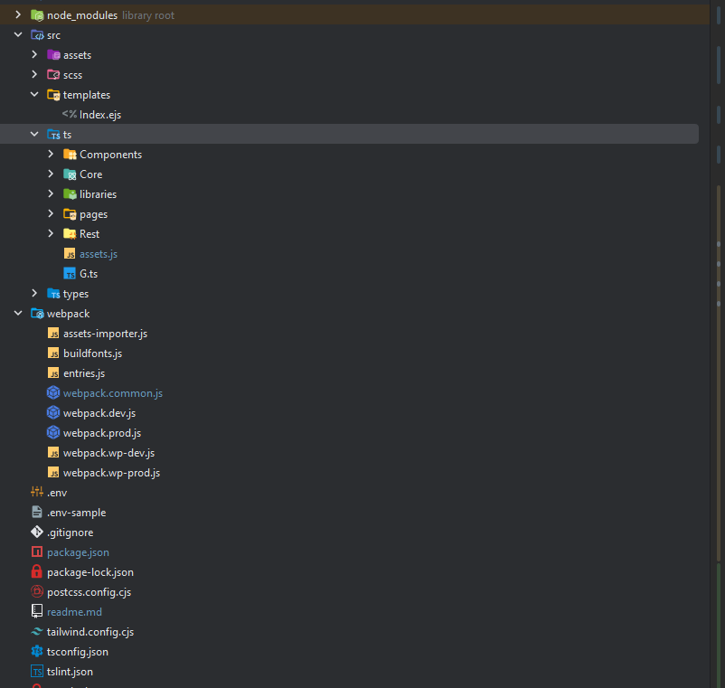
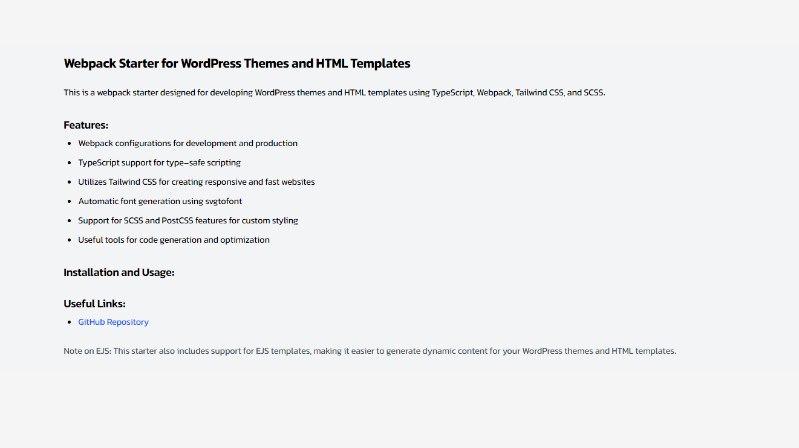

# Webpack Starter

## Setup

1. **Node.js Installation:** Download and install [Node.js](https://nodejs.org/en/download/).

2. **Install Dependencies:** Run the following commands to install project dependencies:

    ```bash
    # Install dependencies (only the first time)
    yarn install
    
   # If you are windows user, install `win-node-env` globally
   yarn add win-node-env --global
   # or 
   npm i -g win-node-env 
    ```

3. **Configuration:** Copy the `.env-example` file to `.env` in the root folder and configure it as needed. Set `THEME_DIR_NAME` to the WordPress theme directory name (it should be the parent of this directory).

4. **Local Development Server:** Start the local development server at [localhost:3000](http://localhost:3000) with the following command:

    ```bash
    yarn run dev
    ```

5. **Build for Production:** To build the project for production in the `dist/` directory, use the following command:

    ```bash
    yarn run build
    ```

6. **Build for Development:** To build the project for development in the `dist/` directory, use the following command:

    ```bash
    yarn run build:dev
    ```

7. **Build for WordPress Theme Development:** To build the project for development compatible with WordPress themes in the `dist/` directory, use the following command:

    ```bash
    yarn run wp-dev
    ```

8. **Build for WordPress Theme Production:** To build the project for production compatible with WordPress themes in the `dist/` directory, use the following command:

    ```bash
    yarn run wp-prod
    ```

## Project Details

- **Assets Bundler:** [Webpack](https://webpack.js.org/)
- **CSS Framework:** [Tailwind CSS](https://tailwindcss.com/)

## Folder Structure

Project files

- src/
  - assets/
    - fonts/
      - iransans/
         - font-file.ttf
         - font-file.woff
    - icons/
      - arrow-right.svg
      - home.svg
      - search.svg
      - autoer svg files ...
    - img/
      - logo.png
      - featured-image.png
      - auther image files ...
- scss/
  - components/
     - pages/
- ts/
  - Core
  - pages
  - Compontents
  - libs
- types/
  - index.d.ts
- templates
  - index.ejs
- sample-page.html
- webpack/
- .env
- .env-example
- .gitignore
- package.json
- readme.md
- tailwind.config.js
- tsconfig.json
- tslint.json


## Example




This is an example of how your project's folder structure might look, along with the added image for reference.

Feel free to customize and expand this README as needed for your project.
